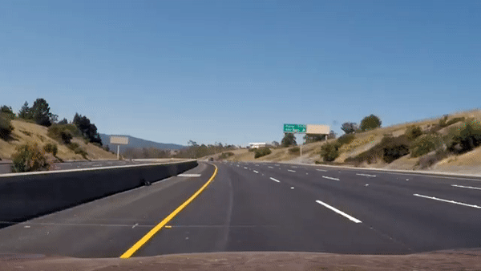
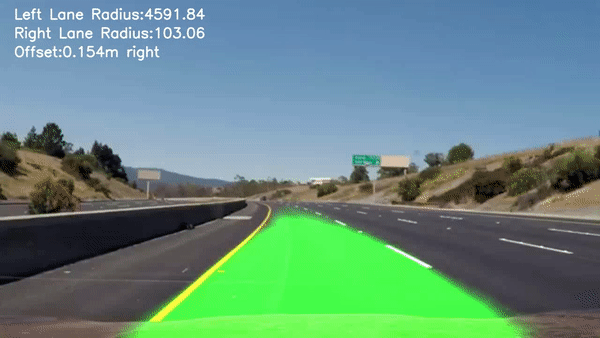

# 🚗 Lane Detection Algorithm

   

## 🎯 Aim
The objective of this research is to develop a robust algorithm capable of detecting lanes on a roadway, alongside calculating and displaying critical features such as the offset from the center of the lane and the radius of curvature of the road.

---

## 🛠️ Methodology

### Part 1: Identification of the Lanes

**🔍 CNN Model**:  
The proposed methodology employs a SegNet architecture with specific optimizations. This architecture leverages encoder-decoder pairs to generate feature maps for classification at various resolutions. The input to the model is an image of a road, while the labeled output is an image with the lane highlighted in a single RGB channel. Thus, the CNN model's output is an image with the lane marked in a single RGB channel.

- **Data Set**: The dataset comprises 13,000 inputs and corresponding labels, each with dimensions of 80 x 160 pixels.
- **Tools/Packages**: Keras, Scikit-learn
- **Language**: Python

**🧩 Architecture**:
- **Encoding Layer**: This layer consists of 7 convolutional layers interspersed with max-pooling and dropout layers to enhance feature extraction and prevent overfitting.
- **LSTM Layer**: Incorporates 2 LSTM layers with resizing operations after each layer to maintain consistent matrix dimensions, facilitating temporal feature learning.
- **Decoding Layer**: Comprises 7 layers of transposed convolution (deconvolution) with intermittent upsampling and dropout layers, reconstructing the spatial dimensions of the input image.
- **Optimizer**: Adam optimizer is utilized to minimize the loss function.
- **Loss Function**: Mean squared error is employed as the loss function to measure the reconstruction quality.

**📊 Results**:
- **Batch Size**: 128
- **Epochs**: 10
- **Accuracy**:
  - Without LSTM layers: 92%
  - With LSTM layers: 93.5%

### Part 2: Mathematical Calculation and Extraction of Offset and Radius of Curvature of the Road

**🔍 Model**:  
The trained CNN model parameters are applied to live camera or video feed to identify the lane markings. Subsequent feature extraction is performed using OpenCV functions and mathematical computations.

- **Tools/Packages**: OpenCV
- **Language**: Python

**🧩 Architecture**:
- **Edge Detection**: Edge detection techniques are employed to delineate the lane boundaries, followed by a perspective transform to obtain a perpendicular view of the lane.
- **Lane Identification**: The sliding window technique is used to segregate the left and right lane boundaries.
- **Polynomial Fit**: A polynomial fit curve function is utilized to derive the quadratic function representing the curvature of the lane.
- **Feature Calculation**: Based on the derived quadratic function, the radius of curvature and the offset from the center of the lane are computed using precise mathematical formulas.

**📊 Results**:
- **Offset Calculation**: Achieves results within a 1-2 meter range, deemed ideal for practical applications.
- **Radius of Curvature**: Two distinct radii of curvature are computed for the left and right lane boundaries, correlating well with the visual curvature observed in the road imagery.

---

## 🏁 Conclusion
The lane detection algorithm developed in this study demonstrates effective performance on recorded road video data, successfully identifying lane boundaries and calculating key features such as the offset and radius of curvature. Further real-time deployment and testing are necessary to validate the model's accuracy and refine the mathematical calculations involved in feature extraction.

